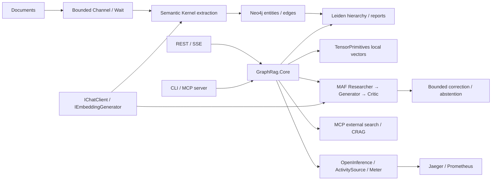

# GraphRAG-MAF-Core

以 C#/.NET 10 實作供應商可切換的 GraphRAG：Semantic Kernel 文件提取、Neo4j GDS Leiden、多智能體審查、MCP 回退、Native AOT API，以及可以重新執行的評估與效能量測。

提供 REST、SSE、CLI、stdio MCP 和 Streamable HTTP MCP。核心與供應商、資料庫、傳輸層分離；`IChatClient` 與 `IEmbeddingGenerator<string, Embedding<float>>` 可透過 DI 切換 Azure OpenAI、Ollama、ONNX 或 OpenAI-compatible 服務。

## 執行

需要 .NET SDK **10.0.401**、Node.js 22+。目前工作目錄已有局部 SDK 時，驗證腳本會自動使用它。

```powershell
.\scripts\verify.ps1
```

這會執行 Release 測試、三種 RAG 模式、SIMD benchmark 與 MCP 協定驗證。離線 fixture 使用確定性模型與記憶體圖，不代表 LLM 品質或 Leiden；輸出會明確標記。

### 一鍵部署

安裝並啟動 Docker Desktop/Linux Docker Engine，然後執行：

```powershell
.\scripts\setup.ps1 -Start
```

腳本產生不納入 Git 的 `.env` 與隨機密鑰。Compose 包含 Neo4j **5.26.31 + GDS 2.13.12**、Ollama、模型初始化、Jaeger **2.21.0**、OTel Collector、Prometheus 與編譯成 Native AOT 的 API。初次部署需要下載容器和模型。預設模型是 `llama3.2:3b` 與 `nomic-embed-text`。

| 入口 | 位址 |
|---|---|
| API / OpenAPI | http://localhost:8080/openapi.json |
| Readiness | http://localhost:8080/health/ready |
| MCP | http://localhost:8080/mcp |
| Neo4j Browser | http://localhost:7474 |
| Jaeger | http://localhost:16686 |
| Prometheus | http://localhost:9090 |

API 使用 `.env` 中的 `APP_API_KEY`，透過 `X-API-Key` 傳入；health endpoints 不需要密鑰。範例請見 [API 與 MCP 操作](docs/usage.md)。

### 切換模型

透過 process environment 或 `.env` 設定，不需要修改業務程式：

| 模式 | `AI_PROVIDER` | `EMBEDDING_PROVIDER` | 必要設定 |
|---|---|---|---|
| Azure OpenAI | `azure` | `azure` | endpoint、API key、聊天與 embedding deployment 名稱 |
| Ollama / GGUF | `ollama` | `ollama` | endpoint、模型名稱 |
| ONNX GenAI + ONNX embeddings | `onnx` | `onnx` | GenAI 模型目錄、ONNX embedding 與 BERT vocabulary |
| Ollama + ONNX embeddings | `ollama` | `onnx` | 可分別設定兩種供應商 |
| 協定服務 | `openai-compatible` | `openai-compatible` | `AI_ENDPOINT`、可選 key、模型名稱 |

ONNX INT8 embedding 範例可以用 `.\scripts\download-embedding.ps1` 取得，下載後核對固定 revision 與 SHA-256。更換 embedding 模型必須使用新資料庫或重新索引；系統拒絕混用 embedding space。[模型契約](models/README.md)、[設定](docs/configuration.md)。

## 架構



`local` 取向量候選並擴展 0–3 跳圖鄰居。`global` 處理最粗層的全部社群報告，以 map/reduce 組織答案，並提供原始 chunks 給 critic 查核。`naive` 使用向量檢索及單一生成智能體，作為相同資料集的基準。

低 cosine heuristic 觸發 MCP 工具發現與搜尋，補充來源必須保留 citation。這個分數不是校準過的機率。MCP 逾時或失敗時保留本地證據；無支持的回答會在固定重試上限後拒答。串流中的草稿增量尚未通過 critic，使用者應以最後的 `result` 為準。

## 實測數據

2026-09-29，Release、.NET 10.0.12。所有數值都有可查核的 JSON，不能推廣成任意硬體與工作負載的保證。

| 向量維度 | Scalar ns/op | TensorPrimitives ns/op | 加速 | Kernel managed allocations |
|---:|---:|---:|---:|---:|
| 128 | 54.61 | 10.38 | 5.26× | 0 bytes |
| 384 | 165.80 | 29.42 | 5.64× | 0 bytes |
| 768 | 329.70 | 65.67 | 5.02× | 0 bytes |
| 1536 | 662.81 | 138.66 | 4.78× | 0 bytes |

[原始 SIMD 量測](artifacts/vector-benchmark.json)：Windows 10.0.26200、28 logical processors，200,000 operations × 5 alternating rounds，採中位數；warm-up 10,000 次，數值誤差 < 6e-8。零配置適用於 cosine kernel；top-k 結果與整個 query 仍會配置記憶體。

| fresh process → HTTP ready，5 次中位數 | Native AOT | JIT |
|---|---:|---:|
| WSL2 Linux filesystem | 30.51 ms | 221.03 ms |
| readiness 時 RSS | 51.56 MiB | 76.71 MiB |
| Windows 掛載磁碟 | 5,510 ms | 7,566 ms |

[Linux filesystem 量測](artifacts/startup-benchmark-linux-fs.json)、[Windows mount 量測](artifacts/startup-benchmark.json)。兩者都是 warm filesystem cache、fixture providers、沒有載入模型的 fresh-process 啟動；不含容器建置、Neo4j 啟動或 LLM 載入。

已執行真正的 ONNX INT8 推論，384 維，相關句 cosine **0.8990**、不同主題 **0.0076**。[模型推論證據](artifacts/onnx-inference-smoke.json)。真正的 Neo4j GDS Leiden 在 4 份 fixture 提取文件上產生 **2 層、5 個社群**。[GDS 查核](artifacts/neo4j-gds-validation.json)。

## 量化評估

`evaluate` 會在相同文件及問題上配對執行 Naive/GraphRAG，用獨立可設定的 LLM judge 輸出原子事實判斷，再計算 Faithfulness、Answer Relevancy、Context Precision、Context Recall。報告保存原始答案、上下文、judge 判斷、資料集雜湊、模型名稱與公式版本。

```powershell
dotnet run --project src/GraphRag.Cli -c Release -- evaluate `
  --corpus data/demo-corpus.json --dataset data/evaluation.json `
  --output artifacts/evaluation.json
```

fixture judge 或 fixture embeddings 不能產生品質分數。目前示範集是 4 份合成文件、8 題，不能據此證明一般性的「GraphRAG 100% vs Naive RAG 0%」，也不能保證比 Naive RAG 準確。[評估方法與限制](docs/evaluation.md)。

## 五階段交付與技術對照

[30 天規劃對照](docs/phase-delivery.md) 列出每個階段的程式、驗證方式和實際驗證邊界。完整驗證證據將記錄在 `artifacts/verification.json`。

目前 SDK 的 MAF 使用 `ChatClientAgent` 搭配 `AgentWorkflowBuilder`；`ChatCompletionAgent` 屬於 Semantic Kernel。GGUF 由 Ollama 執行，ORT GenAI 載入 ONNX GenAI 模型目錄。Self-RAG 反思是 prompted critic，未訓練原論文的 reflection-token checkpoint。C# 評估重現四項 RAGAS 公式與判斷流程，未宣稱等同官方 Python Ragas 的每個版本。[Microsoft MAF](https://learn.microsoft.com/en-us/agent-framework/workflows/workflows)、[ORT C#](https://onnxruntime.ai/docs/genai/api/csharp.html)、[Ragas](https://docs.ragas.io/en/stable/concepts/metrics/available_metrics/)。

## GitHub

`ci.yml` 執行測試、CLI、MCP、SIMD、Linux Native AOT 編譯及 HTTP/SSE smoke，保留驗證 artifacts。`release.yml` 在 `v*` tag 或手動執行時發布 Native AOT container 至 GHCR。它們已寫入專案；是否在 GitHub 成功執行，需要實際推送及 Actions 結果才能確認。

原始碼 MIT 授權；模型、GDS 與容器依各自授權。大型模型、SDK、密鑰、執行檔、暫存資料與資料庫不納入 Git。
